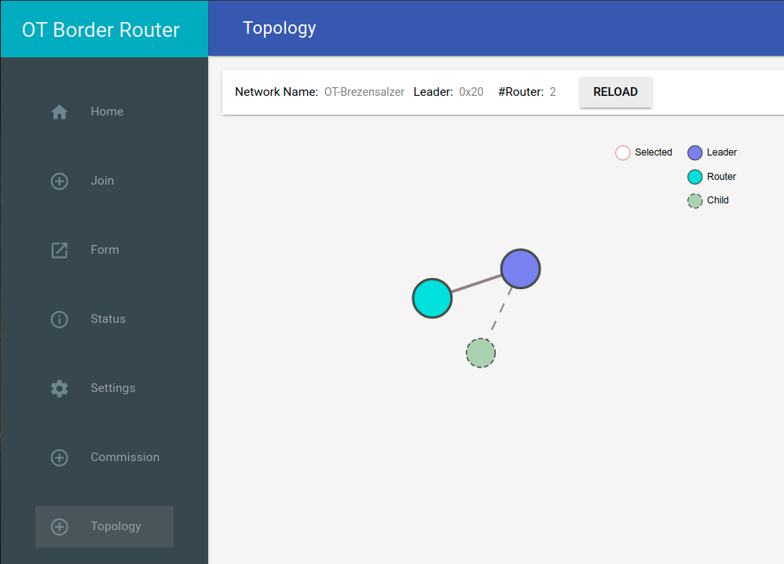

# Experiments with OpenThread, nRF52840, Linux and Arduino

### References
* [OpenThread Homepage](https://openthread.io/?hl=en)
* [OpenThread Border Router repository](https://github.com/openthread/ot-br-posix)
* [OpenThread on nRF52840 repository](https://github.com/openthread/ot-nrf528xx)
* [OpenThread CLI Reference](https://github.com/openthread/openthread/blob/main/src/cli/README.md)
* [Arduino package for OpenThread and nRF52840](https://github.com/soburi/openthread_nrf52_arduino)
* [Unbrick an Adafruit nRF52840 board](https://forums.adafruit.com/viewtopic.php?f=60&t=152060&p=751235&hilit=nrf52840+bricked)

## Hardware
* Raspberry Pi 4B (4GB) and Raspberry Pi OS 11 "Bullseye"
* **OR** any x86 based Linux System with Debian 11 "Bullseye"
* [Makerdiary nRF52840 Dongle](https://wiki.makerdiary.com/nrf52840-mdk-usb-dongle/) 2x for RCP and FTD (*outdated infos on the webpage*)
* [Adafruit ItsyBitsy nRF52840 Express](https://learn.adafruit.com/adafruit-itsybitsy-nrf52840-express)
* [Adafruit MS8607 Temperatur/Humidity/Pressure sensor](https://learn.adafruit.com/adafruit-te-ms8607-pht-sensor)

## Building and flashing the OpenThread Formware
Read: [flash-nrf52840-mdk-dongle.md](./flash-nrf52840-mdk-dongle.md)

## Install the OpenThread Border Router on Raspberry Pi/Debian x86
Read: [otbr-installation.md](./otbr-installation.md)

## Commissioning a Full-Thread-Device FTD to the Thread network
Read: [commissioning-cli.md](./commissioning-cli.md)

## Configuring IPv6
Read: [ot-ipv6-config.md](./ot-ipv6-config.md)

## Scary: Using OpenThread on an Adafruit ItsyBitsy nRF52840 Express
Read: [ot-nrf52-arduino.md](./ot-nrf52-arduino.md)

## Have a look at your Thread network topology in the WebGUI

## ToDo
* learn more about the gory details of the Thread network with the CLI
* learn how to use [Matter](https://en.wikipedia.org/wiki/Matter_(standard)) in combination with [Thread](https://en.wikipedia.org/wiki/Thread_(network_protocol))