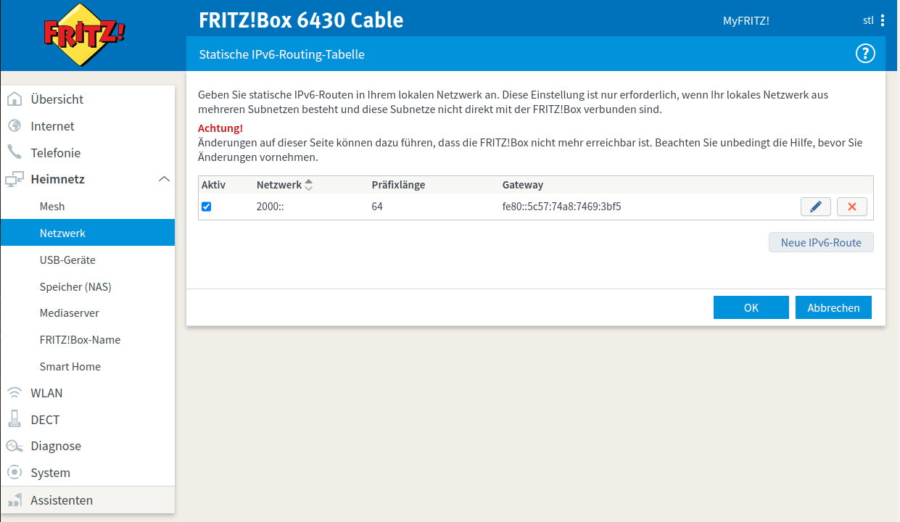

# IPv6 Configuration of the OpenThread-Border-Router (RCP and Linux System)
To connect the OpenThread network natively via IPv6 erreichbar ist, sind folgende Konfigrationen notwendig:
## Configuration RCP
OpenThread IPv6 documentation: https://openthread.io/guides/thread-primer/ipv6-addressing
Configuration of a Global Unicast Address (GUA) with **ot-ctl** on the RCP:
```
> prefix add 2000:0:0:0:/64 paros
done
> netdata register
done
> prefix
2000::/64 paros med 8000
Done
> ipaddr
2000:0:0:0:bfab:570f:5a27:8f40  => Global Unicast Address GUA
fdde:ad00:beef:0:0:ff:fe00:fc11
fdde:ad00:beef:0:0:ff:fe00:fc10
fdde:ad00:beef:0:0:ff:fe00:fc38
fdde:ad00:beef:0:0:ff:fe00:fc33
fdde:ad00:beef:0:0:ff:fe00:fc00
fdde:ad00:beef:0:0:ff:fe00:8000
fdde:ad00:beef:0:186e:7f16:8d5b:bbc4
fe80:0:0:0:5c57:74a8:7469:3bf5 => Link-Local Address (LLA)
Done
```

## Configuration Debian Linux
IPv6 Forwarding should be activated by the OTBR-Installation. This is what I got as IP-Addresses:

```
atom:~# ifconfig
...
wpan0: flags=4305<UP,POINTOPOINT,RUNNING,NOARP,MULTICAST>  mtu 1280
        inet6 fdde:ad00:beef::ff:fe00:fc10  prefixlen 64  scopeid 0x0<global>
        inet6 2000::bfab:570f:5a27:8f40  prefixlen 64  scopeid 0x0<global>            => GUA
        inet6 fdde:ad00:beef:0:186e:7f16:8d5b:bbc4  prefixlen 64  scopeid 0x0<global>
        inet6 fdde:ad00:beef::ff:fe00:fc11  prefixlen 64  scopeid 0x0<global>
        inet6 fdde:ad00:beef::ff:fe00:fc38  prefixlen 64  scopeid 0x0<global>
        inet6 fe80::5c57:74a8:7469:3bf5  prefixlen 64  scopeid 0x20<link>             => LLA
        inet6 fdde:ad00:beef::ff:fe00:8000  prefixlen 64  scopeid 0x0<global>
        inet6 fdde:ad00:beef::ff:fe00:fc00  prefixlen 64  scopeid 0x0<global>
        inet6 fdde:ad00:beef::ff:fe00:fc33  prefixlen 64  scopeid 0x0<global>
        unspec 00-00-00-00-00-00-00-00-00-00-00-00-00-00-00-00  txqueuelen 500  (UNSPEC)
        RX packets 1339  bytes 191757 (187.2 KiB)
        RX errors 0  dropped 1  overruns 0  frame 0
        TX packets 224  bytes 20100 (19.6 KiB)
        TX errors 0  dropped 0 overruns 0  carrier 0  collisions 0

eno1: flags=4163<UP,BROADCAST,RUNNING,MULTICAST>  mtu 1500
        inet 192.168.1.4  netmask 255.255.255.0  broadcast 192.168.1.255
        inet6 2a02:810d:4bc0:2de0:f64d:30ff:fe6c:2da3  prefixlen 64  scopeid 0x0<global>
        inet6 fe80::5c57:74a8:7469:3bf5  prefixlen 64  scopeid 0x20<link>           => wpan0 LLA !
        inet6 fe80::f64d:30ff:fe6c:2da3  prefixlen 64  scopeid 0x20<link>           => eno1 LLA
        ether f4:4d:30:6c:2d:a3  txqueuelen 1000  (Ethernet)
        RX packets 23195617  bytes 16661820069 (15.5 GiB)
        RX errors 0  dropped 162  overruns 0  frame 0
        TX packets 22650540  bytes 18935590622 (17.6 GiB)
        TX errors 0  dropped 0 overruns 0  carrier 0  collisions 0
        device interrupt 16  memory 0xdc300000-dc320000  
```
Check the local routes on the system:
```
atom:~# ip -6 route
2000::/64 dev wpan0 proto kernel metric 256 pref medium      => this is our route
2a02:810d:4bc0:2de0::/64 dev eno1 proto kernel metric 256 expires 6723sec pref medium
2a02:810d:4bc0:2de0::/64 via fe80::e228:6dff:fe54:6e29 dev eno1 proto ra metric 1024 expires 1323sec pref medium
fdde:ad00:beef::/64 dev wpan0 proto kernel metric 256 pref medium
fe80::/64 dev eno1 proto kernel metric 256 pref medium
fe80::/64 dev br-fbe8bd369ccf proto kernel metric 256 pref medium
fe80::/64 dev veth01c845e proto kernel metric 256 pref medium
fe80::/64 dev veth54471ad proto kernel metric 256 pref medium
fe80::/64 dev veth830bb25 proto kernel metric 256 pref medium
fe80::/64 dev docker0 proto kernel metric 256 linkdown pref medium
fe80::/64 dev wpan0 proto kernel metric 256 pref medium
ff05::abcd dev wpan0 metric 1024 pref medium
ff05::abcd dev eno1 metric 1024 pref medium
default via fe80::e228:6dff:fe54:6e29 dev eno1 proto ra metric 1024 expires 1323sec hoplimit 255 pref medium
```
The route should be there already, otherwise configure it with `ip -6 route add ...`.

## Add IPv6 route in the Fritzbox router:



You must use the Link-Local-Address LLA of the wpan0 interface as gateway:
```
Netzwerk: 2000::
Präfix:   64
Gateway:  fe80::5c57:74a8:7469:3bf5
``` 
## Testing
Test machine tardis:
```
root@tardis:~# ifconfig
...
eno1: flags=4163<UP,BROADCAST,RUNNING,MULTICAST>  mtu 1500
        inet 192.168.1.104  netmask 255.255.255.0  broadcast 192.168.1.255
        inet6 2a02:810d:4bc0:2de0:96c6:91ff:feaf:b803  prefixlen 64  scopeid 0x0<global> => GUA
        inet6 fe80::96c6:91ff:feaf:b803  prefixlen 64  scopeid 0x20<link>
        ether 94:c6:91:af:b8:03  txqueuelen 1000  (Ethernet)
        RX packets 284443  bytes 326239460 (326.2 MB)
        RX errors 0  dropped 7806  overruns 0  frame 0
        TX packets 47754  bytes 5528344 (5.5 MB)
        TX errors 0  dropped 0 overruns 0  carrier 0  collisions 0
        device interrupt 16  memory 0xc0b00000-c0b20000  

root@tardis:~# ping 2000:0:0:0:bfab:570f:5a27:8f40 => GUA RCP
PING 2000:0:0:0:bfab:570f:5a27:8f40(2000::bfab:570f:5a27:8f40) 56 Datenbytes
64 Bytes von 2000::bfab:570f:5a27:8f40: icmp_seq=1 ttl=255 Zeit=0.833 ms
64 Bytes von 2000::bfab:570f:5a27:8f40: icmp_seq=2 ttl=255 Zeit=0.764 ms
64 Bytes von 2000::bfab:570f:5a27:8f40: icmp_seq=3 ttl=255 Zeit=0.645 ms
^C
--- 2000:0:0:0:bfab:570f:5a27:8f40 ping statistics ---
3 Pakete übertragen, 3 empfangen, 0% Paketverlust, Zeit 2051ms
rtt min/avg/max/mdev = 0.645/0.747/0.833/0.077 ms

root@tardis:~$ **ping 2000:0:0:0:65f5:6916:af4a:a06 => GUA Thread Router**
PING 2000:0:0:0:65f5:6916:af4a:a06(2000::65f5:6916:af4a:a06) 56 Datenbytes
64 Bytes von 2000::65f5:6916:af4a:a06: icmp_seq=1 ttl=63 Zeit=33.2 ms
64 Bytes von 2000::65f5:6916:af4a:a06: icmp_seq=2 ttl=63 Zeit=16.1 ms
64 Bytes von 2000::65f5:6916:af4a:a06: icmp_seq=3 ttl=63 Zeit=17.0 ms
^C
--- 2000:0:0:0:65f5:6916:af4a:a06 ping statistics ---
3 Pakete übertragen, 3 empfangen, 0% Paketverlust, Zeit 2003ms
rtt min/avg/max/mdev = 16.129/22.111/33.181/7.835 ms
```
Test node nRF52840-MDK Dongle (Full-Thread-Device with ot-cli-ftd.uf2 firmware):
```
stl@tardis:~$ screen /dev/ttyACM1 115200
> ipaddr
fdde:ad00:beef:0:0:ff:fe00:4800
2000:0:0:0:65f5:6916:af4a:a06    => GUA
fdde:ad00:beef:0:872b:e198:b161:3baa
fe80:0:0:0:48c6:7410:ce0b:8fb2
Done
> ping 2a02:810d:4bc0:2de0:96c6:91ff:feaf:b803 => IPv6 address tardis
16 bytes from 2a02:810d:4bc0:2de0:96c6:91ff:feaf:b803: icmp_seq=1 hlim=253 time=12ms
1 packets transmitted, 1 packets received. Packet loss = 0.0%. Round-trip min/avg/max = 12/12.0/12 ms.
Done
```
