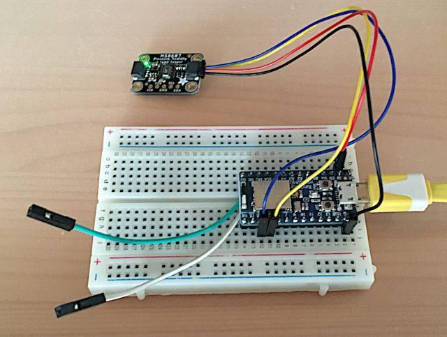

# Using OpenThread on an Adafruit ItsyBitsy nRF52840 Express
I have found an excellent Arduino package for Adafruit nRF52840 development boards with OpenThread support:
[soburi/openthread_nrf52_arduino](https://github.com/soburi/openthread_nrf52_arduino)

***To use it, you have to burn a new bootloader on your board. You definitely have to use a J-Link programmer, it is not possible to do that with uf2 files and the uf2 flash disk. Ask how I know that. Yep, I bricked my ItsyBitsy.***

So I bought a J-Link programmer (clone), soldered two wires on the [SWDIO and SWCLK pads](https://learn.adafruit.com/assets/87066) on the underside of the ItsyBitsy and reanimated my board as described by soburi.
It is now ready for OpenThread in the Arduino IDE.



Based on the example I wrote a sketch ([ot-sensor.ino](./arduino/ot-sensor/ot-sensor.ino)) which reads out a MS8607 sensor and sends the data via IPv6 multicast to the OTBR. At startup the red LED lights up for 2s. Press the SW-Button on the board until the light goes out. The board is now in joining/commissioning mode. Once joined, it will connect at once to the thread network after start up. 

Based on an example on [Home Smart Mesh](https://www.homesmartmesh.com/docs/microcontrollers/nrf52/thread_sensortag/#development), I wrote a litte python script which listens on the UDP port and publishes the data to MQTT: [thread2mqtt.py](./python/thread2mqtt.py)

Now subscribe to the topic:
```
stl@atom:~$ mosquitto_sub -h localhost -t thread/ 
{ CurrentTemperature: 23.12, CurrentRelativeHumidity:29.79, CurrentPressure: 969.03, Alive: 2879 }
{ CurrentTemperature: 23.12, CurrentRelativeHumidity:29.85, CurrentPressure: 969.04, Alive: 2880 }
{ CurrentTemperature: 23.12, CurrentRelativeHumidity:29.82, CurrentPressure: 968.98, Alive: 2881 }
```